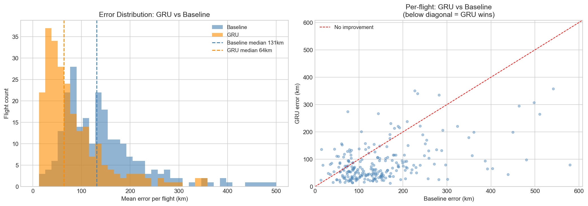
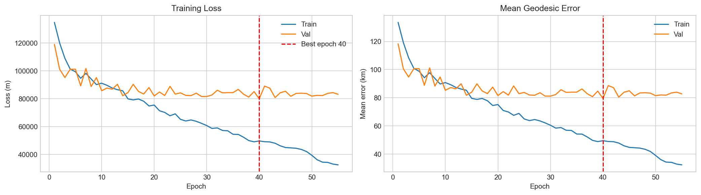
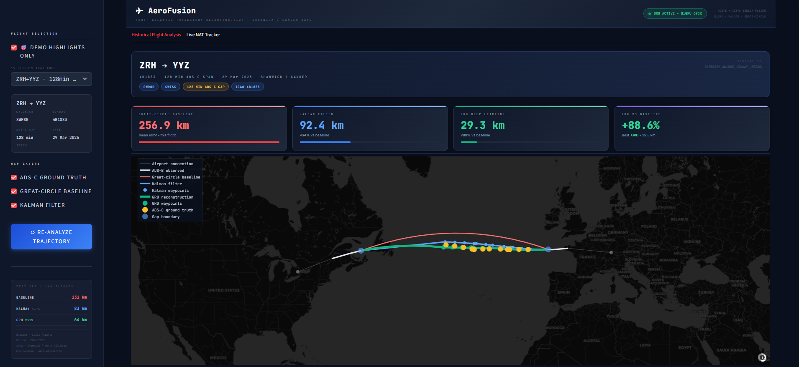
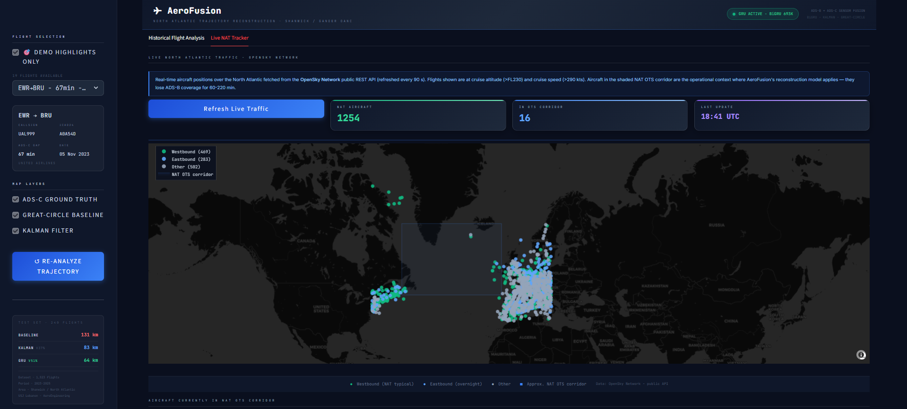

<div align="center">

# AeroFusion
### ADS-B / ADS-C Trajectory Fusion for North Atlantic Gap-Filling
<!-- Replace the line below with your title image once uploaded -->


[](https://python.org)
[](https://streamlit.io)
[](https://hub.docker.com/r/johnelhachem/aeroengineering_ml)
[](https://pytorch.org)
[](LICENSE)


</div>

---

## The Problem

When a commercial aircraft crosses the North Atlantic Ocean, it disappears from conventional ADS-B radar coverage for **60 to 220 minutes**. Air traffic controllers rely on ADS-C — a satellite-based protocol that transmits sparse position reports every ~14 minutes — leaving large gaps in the trajectory record.

AeroFusion reconstructs the **full continuous trajectory** across those blackout windows by fusing:
- ADS-B context collected before and after the oceanic segment
- ADS-C waypoints captured during the crossing
- A Bidirectional GRU model trained on 1,704 real transatlantic crossings

The result is a dense, per-minute position estimate with altitude, far more accurate than the standard great-circle interpolation used today.

---

## Results at a Glance

| Method | Median Position Error | Mean Position Error | vs. Baseline |
|---|---|---|---|
| Great-circle baseline | 131.0 km | 149.5 km | — |
| Kalman smoother | 88.3 km | — | −33% |
| **BiGRU (AeroFusion)** | **64.0 km** | **84.3 km** | **−51%** |

> Evaluated on **240 held-out** NAT crossings, split by aircraft ICAO24 to prevent data leakage.  
> Mean oceanic blackout: **~239 minutes** · Altitude RMSE: **412 ft** · Model params: **1,045,795**

<div align="center">

<!-- These images are generated by the evaluation notebooks -->



</div>

---

## Demo App

The interactive Streamlit demo lets you explore the three reconstruction methods side-by-side on 19 curated transatlantic flights.

<div align="center">

<!-- Add your demo screenshots here after uploading to docs/images/ -->



</div>

### Tab 1 — Flight Reconstruction

Select any of the 19 curated demo flights from the sidebar. The app displays:

- **Interactive globe map** (Plotly) with three overlaid trajectories: great-circle baseline (red), Kalman smoother (blue), and BiGRU prediction (green), plotted against the ADS-C ground truth (white dashed)
- **Per-flight metrics** — median position error for each method, gap duration, number of ADS-C waypoints, and altitude RMSE
- **Altitude profile** chart comparing predicted vs. ground-truth altitude over the oceanic segment
- **Pipeline overview** cards explaining each processing step

Flights were hand-picked to maximise **route diversity** (LHR/CDG/AMS/ZRH/IST/DOH/TLV/DEL → JFK/EWR/BOS/MIA/SFO/CUN), **airline diversity** (BAW, UAL, AAL, KLM, THY, SWR), and **year coverage** (2023–2025), including one rare eastbound crossing (JFK → LHR).

### Tab 2 — Live NAT Tracker

Queries the **OpenSky Network public REST API** (90-second cache) to display aircraft currently flying westbound and eastbound in the North Atlantic corridor in real time. Fails gracefully when the API rate-limits. Provides a live feel while presenting the historical reconstruction results.

---

## Project Structure

```
AeroFusion/
│
├── demo_app.py                     # Streamlit interactive demo
├── Dockerfile                      # Production container (serves demo on :8501)
├── requirements.txt
├── setup.py
│
├── src/
│   └── aero_fusion/
│       ├── ingest.py               # Step 1 — OpenSky Trino data pull
│       ├── step1_master.py         # Step 1 orchestrator
│       ├── step2_clean.py          # Step 2 — trajectory cleaning & validation
│       ├── step3_baseline.py       # Step 3 — great-circle baseline
│       ├── step4_build_ml_dataset.py  # Step 4 — feature engineering
│       ├── step5_kalman.py         # Step 5a — Kalman smoother
│       ├── step5_train_gru.py      # Step 5b — BiGRU training (Colab-ready)
│       ├── step6_analytics.py      # Step 6 — fleet-level analytics
│       ├── step7_serve.py          # Step 7 — FastAPI inference endpoint
│       ├── step8_monitoring.py     # Step 8 — drift & performance monitoring
│       ├── trino_io.py             # OpenSky Trino query helpers
│       ├── validation.py           # Segment validation logic
│       ├── plotting.py             # Shared Plotly helpers
│       ├── emissions_calculator.py # CO₂ estimation utilities
│       └── utils/
│
├── notebooks/
│   ├── 01_ingest_flight_data.ipynb        # Pull raw ADS-B + ADS-C from OpenSky
│   ├── 02_clean_dataset.ipynb             # Clean, validate, split segments
│   ├── 03_baseline_reconstruction.ipynb   # Great-circle interpolation baseline
│   ├── 04_build_ml_dataset.ipynb          # Build tensors for GRU training
│   ├── 05a_step5_kalman_evaluation.ipynb  # Kalman smoother results
│   ├── 05b_step5_gru_evaluation.ipynb     # BiGRU training & evaluation
│   ├── 06_analytics.ipynb                 # Fleet-level statistics
│   ├── 07_api_demo.ipynb                  # FastAPI endpoint walkthrough
│   └── 08_monitoring.ipynb                # Model drift monitoring
│
└── artifacts/
    ├── step1_dataset/          # Raw ingested segments
    ├── step2_clean/            # Cleaned catalog + per-flight parquet files
    ├── step3_baseline/         # Baseline predictions
    ├── step4_ml_dataset/       # Training tensors
    ├── step5_gru/
    │   ├── best_model.pt           # Trained BiGRU weights
    │   ├── test_summary.json       # Evaluation metrics
    │   ├── error_comparison.png
    │   ├── training_curves.png
    │   └── example_reconstructions.png
    ├── step5_kalman/           # Kalman smoother results
    ├── step6_analytics/
    ├── step7_example.png
    └── step8_monitoring/
```

---

## Quick Start

### Option A — Docker (recommended, zero setup)

The Docker image ships with model weights and demo flight data included. No OpenSky credentials required.

```bash
# Pull the pre-built image
docker pull johnelhachem/aeroengineering_ml:latest

# Run the demo (Streamlit on port 8501)
docker run -p 8501:8501 johnelhachem/aeroengineering_ml:latest
```

Then open **http://localhost:8501** in your browser.

To also expose the FastAPI inference endpoint on port 8000:

```bash
docker run -p 8501:8501 -p 8000:8000 johnelhachem/aeroengineering_ml:latest
```

### Option B — Local Python environment

**Prerequisites:** Python 3.12, Git

```bash
# 1. Clone
git clone https://github.com/<your-org>/AeroFusion.git
cd AeroFusion

# 2. Create virtual environment
python -m venv .venv

# Windows
.venv\Scripts\Activate.ps1
# Linux / macOS
source .venv/bin/activate

# 3. Install dependencies
pip install -r requirements.txt
pip install -e .
```

**Run the Streamlit demo:**

```bash
streamlit run demo_app.py
# Opens at http://localhost:8501
```

**Run the FastAPI inference server:**

```bash
python -m aero_fusion.step7_serve
# API docs at http://localhost:8000/docs
```

---

## Build the Docker Image Locally

```bash
# From the project root (artifacts/ must be present with model weights)
docker build -t aerofusion:local .

# Run
docker run -p 8501:8501 aerofusion:local
```

> The Dockerfile uses `python:3.12-slim`, installs CPU-only PyTorch to keep the image lean, and copies only the artifact subdirectories needed by the demo (model weights, cleaned catalog, test results). No GPU required.

---

## Rebuilding from Scratch (Full Pipeline)

> Requires OpenSky Trino credentials. GRU training is designed to run on Google Colab (free GPU).

```bash
# Step 2 — clean raw segments
python -m aero_fusion.step2_clean

# Step 3 — great-circle baseline
python -m aero_fusion.step3_baseline

# Step 4 — build ML feature tensors
python -m aero_fusion.step4_build_ml_dataset

# Step 5a — Kalman smoother
python -m aero_fusion.step5_kalman

# Step 5b — GRU training (upload to Google Colab for GPU)
#   Upload src/aero_fusion/step5_train_gru.py and artifacts/step4_ml_dataset/
#   to a Colab notebook, then download best_model.pt back to artifacts/step5_gru/

# Step 6 — analytics
python -m aero_fusion.step6_analytics

# Step 7 — serve
python -m aero_fusion.step7_serve

# Step 8 — monitoring
python -m aero_fusion.step8_monitoring
```

Alternatively, run each notebook in `notebooks/` in order (01 → 08).

---

## Pipeline Overview

```
OpenSky Trino
  └─► 01 Ingest        Pull ADS-B state vectors + ADS-C waypoints (35–70°N, 65°W–10°E)
        └─► 02 Clean   Validate segments, remove geo-outliers, split train/val/test
              └─► 03 Baseline   Great-circle interpolation (naïve reference)
                    └─► 04 ML Dataset   Build input tensors: ADS-B context + ADS-C sparse points
                          ├─► 05a Kalman   Extended Kalman smoother (physics-based)
                          └─► 05b BiGRU    Seq2Seq BiGRU trained with exact haversine loss
                                └─► 06 Analytics   Fleet stats, error distributions
                                      └─► 07 FastAPI   REST inference endpoint
                                            └─► 08 Monitoring   Drift detection, alerting
```

---

## Model Architecture

The BiGRU model is a sequence-to-sequence architecture:

- **Encoder** — Bidirectional GRU over the pre-oceanic ADS-B context window (position, altitude, speed, heading)
- **Decoder** — Sequential GRU conditioned on sparse ADS-C waypoints and last ADS-B dynamics, predicting one position per minute
- **Loss** — Exact haversine distance (great-circle km) between predicted and ground-truth coordinates
- **Hidden size** — 160 · **Parameters** — 1,045,795 · **Best epoch** — 40

---

## Data Sources

| Source | Table | Coverage |
|---|---|---|
| OpenSky Trino | `minio.osky.state_vectors_data4` | ADS-B position, altitude, speed, heading |
| OpenSky Trino | `minio.osky.adsc` | Oceanic ADS-C waypoints |
| OpenSky Trino | `minio.osky.flights_data4` | Flight metadata |

- **Region:** Shanwick / North Atlantic — 35–70°N, 65°W–10°E  
- **Period:** July 2023 – August 2025  
- **Final dataset:** 1,704 validated NAT crossing segments  
- **Split:** 1,094 train / 189 val / 240 test (stratified by ICAO24)

---

## Presentation & Report

The project report and slide deck are included in the repository:

- `AeroEngineering - Report.pdf` — full technical report
- `AeroEngineering - PPT.pptx` — capstone presentation slides

---

## Reference

> Schäfer, M. et al. *OpenSky Report 2025.* arXiv:2505.06254 (2025).

---

<div align="center">

Made at **Université Saint-Joseph de Beyrouth** · AeroEngineering Capstone · 2026

</div>
